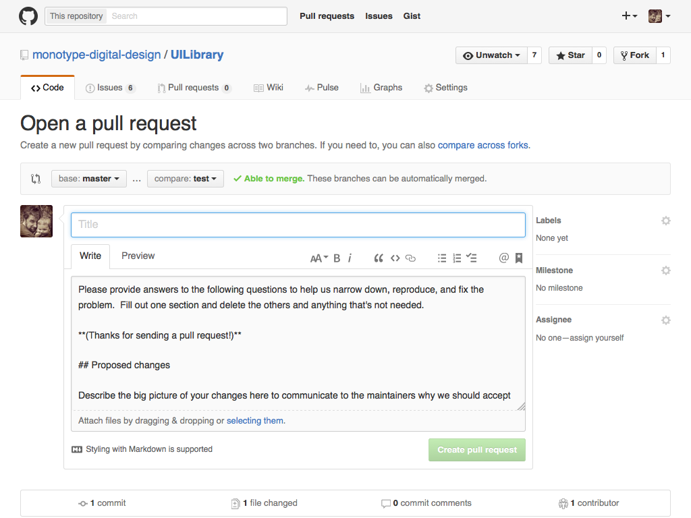

# UI Pattern Library

Welcome to Monotype's UI Pattern Library.

- [Setting Up](#Setting-Up)
- [Adding a new pattern](#adding-a-new-pattern-workflow)
- [Raising a bug](#raising-a-bug)
- [Creating a release](#creating-a-release)
- [How to write your Sass](#How-to-write-your-Sass)
- [Issues and Pull Requests Workflow](#Issues-and-Pull-Requests)


## Setting Up

To use the UI Pattern Library your machine will require some software to be installed to start.

The software you will need is:

  - Node.js
  - Gulp

You can check to see if you have these installed in the command line by entering the name of the package with -v afterwards, for example.

```
$ node -v

$ gulp -v
```

If either of these throw an error in your command line application then you will need to install them.

#### To Install Node

The easiest way to download and install Node is via the [downloads page](https://nodejs.org/download/) where you can download the correct version for your operating system.

#### To Install Gulp

Once you have Node install you can easily install the Gulp task manager by entering the following command into your command line application:

```
$ npm install gulp --global
```

## Installing the UI Pattern Library

You will need to install this repo onto your machine so that you can update, ammend, and and delete patterns to the UI Pattern Library as required.

- Navigate to the to your development folder (usually `sites`).
```
$ cd Sites
```
- Clone the repo from Github onto your machine
```
$ git clone git@github.com:monotype-digital-design/UILibrary.git
```
- Once the repo has installed enter the directory:
```
$ cd UILibrary
```
- Install the Gulp plugins using NPM:
```
$ npm install
```

## Running the UI Pattern Library

To run the UI Pattern Library locally on your machine you need to enter the following command into your command line application:

```
$ gulp dev
```

This will create a local server, compile Sass and concatenate Javascript and watch for any changes or additions and opens your default browser to a `localhost` address.

As well as opening a browser window so you can see the pattern library you are also able to test the patterns on any other device connected to the same WiFi network by using the external url that's printed out in your command line application.


## Adding A New Pattern Workflow

- Make sure you have the latest version of the design language on your machine
```
  `$ git pull`
```
- After this it might be worth running npm install to see if there's any new gulp plugins added
```
`$ npm install`
```
- then get the design language running locally
```
`$ gulp dev`
```

### Creating files for a new pattern

Each pattern has an HTML, CSS and (maybe) a JavaScript file associated with it. You will need to create these files to add them into the pattern library.

#### HTML files

The HTML files for the UI Pattern Library are found in the `containers` folder which can be found in the `markup` folder.

Create a new .html file with a name that describes (as best possible) the pattern you're adding. For example if you have created a new 'sidebar widget' you would call the file something like `sidebar-widget.html`. The pattern libraries code will spot changes in this folder and should refresh the browser window (if you have `$ gulp dev` running).

#### Sass(CSS) files

The Sass (SCSS) files for the UI Pattern Library are found in the `block` folder within the `scss` folder.

Create a new .scss file with the same file as the pattern in the `block` folder making sure it is prefixed with an underscore ie: \_sidebar-widget.scss (not sidebar-widget.scss).

You will need to tell Sass that you have a new file that needs to be compiled. To do this you will need to open the `style.scss` file that is found in the `scss` folder. Once opened look for the `blocks` section. Then add an `@import` to that file after the last declaration in that block. For example

```
  @import "block/pangrams";
  @import "block/sidebar-widget";
```

#### Javascript files

The JavaScript files for the UI Pattern Library are found in the `js-patterns` folder which can be found in the `scripts` folder.

Create a new .js file with the same name as the pattern in the `js-patterns` folder, ie: sidebar-widget.js
 The pattern libraries code will spot changes in this folder and should refresh the browser window (if you have `$ gulp dev` runnin

#### Work on the pattern

You are now ready to add the needed coded, edit it and get it ready for the UI Pattern Library.

#### Adding the the project repository

Once you've completed the pattern and it's at a stage where it's ready to be added you will need to:


- Pull the repository
```
$ git pull
```

- Add all files to be committed
```
$ git add --all
```

- Commit the pattern to the repository
```
$ git commit -a -m "adds new pattern called example to design language"
```

- Push the pattern to the repo
```
  $ git push
```

If you're ready to make the pattern available to the Monotype Core Framework you will need to follow the 'Creating a Release' instructions below.

## Editing an existing pattern

- Make sure you have the latest version of the design language on your machine
```
  `$ git pull`
```
- After this it might be worth running npm install to see if there's any new gulp plugins added
```
  `$ npm install`
```
- then get the design language running locally
```
  `$ gulp dev`
```
- Find the files for the pattern you wish to work on.
- Work on the pattern.
- Once it's complete pull the repository

```
  $ git pull
```

- Commit the pattern

```
  $ git commit -a -m "adds new pattern called example to design language"
```

- Push it to the repo

```
  $ git push
```

## Creating a Release

If you want to have your latest commits ready for use by others you will need to `tag` an update. This will let Bower know that there's a newer version of the patterns to use. Make sure you've committed and push all works ready for release and do the following. Please try to follow the [semantic versioning](http://semver.org/) when releasing updates.

### Semantic Versioning in a nutshell

- If it's a fix to some erroneous code you will be creating a `patch`
- If it's a minor release of a small code update or addition it's a `feature`
- If it's a major release with lots of new features or something completely re-written it's `release`

### Pushing a release

1. Make sure all of your code is working and committed to the repo.
2. Depending on the semantic versioning:
  - `$ gulp patch`
  - `$ gulp feature`
  - `$ gulp release`
3. Push to the repo:
  - `$ git push origin master --tags`


Doing this will make the latest version of the UI Pattern Library available to anything that uses it via Bower.

### Creating a Build for the website

To have the latest version of the UI Library on ux.monotype.com you will need to create a build or 'dist' folder of all the files needed. To do this make sure everything is up-to-date and you have created and pushed a release. Then whilst you are in the folder for the UI Library in the command line type:

```
  $ gulp del
```

This will delete an existing temporary or build folder then type

```
  $ gulp build
```

This will create a new folder called 'dist' where all the relevant HTML, PHP, CSS and Javascript is for you to then copy and paste into the relevant folder for it to appear on ux.monotype.com


## How to write your Sass

One of the tenants behind the UI Pattern Library is to make it as simple as possible to integrate into your workflow. Although we are using Sass in this project we will need to keep the code as close to CSS as possible so that it's easily understandable.


### Nesting

Sass allows [Nesting](http://www.sitepoint.com/sass-reference/selector-nesting/) of CSS. This is a very nice feature but can be over used and abused. To stop this getting out of hand you should only nest media queries, pseudo classes and where referencing the parent makes sense (things like .no-js and modernizr classes).

For example, in Sass you would write

```
a {
  text-decoration: none;
  &:hover {
    text-decoration: underline;
  }
  @media (min-width: 800px) {
    font-weight: 700;
  }
  .no-js & {
    color: blue;
  }
}
```

For this in your CSS
```
a {
  text-decoration: none;
}
a:hover {
  text-decoration: underline;  
}
@media (min-width: 800px) {
  a {
    font-weight: 700;
  }
}
.no-js a {
  color: blue;
}
```


### Variables

[Variables](http://www.sitepoint.com/sass-reference/variables/) in Sass allow you to reuse things like font stacks, colors and margins etc. Within the UI Pattern Library there is a file within the `global` folder called `_variables.scss` where these are defined.

If you find yourself repeating a declaration in your CSS a few times it may be worth adding a new variable for this. Try to be as abstract as you can when naming it. For example rather than write `$tab-navigation-padding: 10px;` and `$tab-card-padding: 10px;` consider writing `$tab-padding` or `$padding-small;` so that it can be used elsewhere without confusion.

### Mixins

By default there are only a limited amount of mixins in the UI Pattern Library. They are more to make writing code easier than doing anything fancy. If you take a look at the `_mixin.scss` file that's in the `global` folder in the `scss` folder there is a mixin that will make writing media queries, responsive typography and placeholders's easier when using a pattern. As this UI Pattern Library can make it's way into various aspects of the company mixins should be kept to a minimum so that it is easy to understand what they do.


## Raising a bug

If you find a bug in the code that needs fixing, or you have been presented a bug from TFS then before you need to create an issue on Github.

### Check Issues Page

First check that the bug you found isn’t already listed:


If it is listed check the issue information and add any comments necessary. If it is not listed create a new issue by clicking the "New Issue" button.

### Create a new issue

This will take you to a blank issue template.


Be as explicit as you can:

- Make sure the title is to the point
- add as much detail in the comment area as possible

### Add labels

Add some labels to the issue so it's easy to tell from a quick look if it's a bug or a feature


### Assign someone to look at it

Assigning someone to the issue will let them know there's something to look at. You can assign yourself if you will be working on the issue.


# Issues and Pull Requests

## Overview

With the potential for more developers working with the UI Library and the potential for developers across the company to fix any bugs there is a need to define a workflow on how to use git and GitHub for the UI Library.

## Branches

### Master

The master is the ‘single source of truth’ you should never commit directly to it, but merge code into from another branch.

## Branching

Always branch from master.

### Branch naming conventions

#### Creating a new pattern

If you are adding a new pattern, amending how a pattern works then you need to give a short descriptive name prefixed with `feature.`. For example `feature.social-buttons`.

#### Making a fix to existing pattern code

If you are amending a pattern so that it fixes a bug or fixing any of the tooling (`gulpjs`) code then you need to give a short descriptive name prefixed with `hotfix.`. For example `hotfix.gulp-sass`.


## Creating a new branch

To create a new branch in the terminal, first make sure you are on the development branch of the repo.

`$ git checkout master`

Make sure this is up-to-date

`$ git pull`

You now have to create a new branch

`$ git checkout -b your_branch`

note: If you’re working on a new feature or bug and find something else that needs adding that is separate make sure you create a new branch (from Master) for this.

## Pushing ‘up stream’

When you have finished and have committed your work locally you will need to push the branch to github.  

- `$ git push origin <branch-name>`
- `$ git push --set-upstream origin <branch-name>`

Will create a remote branch of your local branch on Github and will push any of the changes you have made.


## Pull Request and Peer Reviews

When you’ve pushed the branch you will need to log into GitHub and create a pull request.

Please be as detailed as you can with the pull request and use the template provided to work with.




This will then be peer reviewed by the team. If this is an urgent fix please get in touch with a member of the review team to check it.


### Workflow overview

- `$ cd your/local/domain/UILibrary`
- `$ git pull`
- `$ git checkout -b <branch-name>`
- work on the branch
- commit locally
- `$ git push origin <branch-name>`
- log in to Github
- create the pull request


## Peer Review

If no-one in The Working Group (TGW) is assigned to a pull request then you can assign yourself to check it out. If you created the pull request it is best practice to ask someone else to check your code.

### Testing the Pull Request
You will need to run the changes locally to make sure the changes / additions in the code within the PR work and do not break anything else.

The steps to do this are:

- make sure you’re in the UI Library folder  
- `$ git fetch origin`
- `$ git checkout <branch-name> origin/<branch-name>`
- teet the code
- if if passes:
	- `$ git merge master`
	- `$ git checkout master`  
	- `$ git merge --no-ff <branch-name>`
	- `$ git push origin master`
	- comment on the Pull Request
- if it fails:   
	- comment on the Pull Request.

## Create a release

When you merge a pull request you will also need to update the UI Library’s version number (so that it can be used in mtcore). There are some gulp commands that help you [create a release](Creating-a-Release).


## Tidying Up

Once the code has been merged and the pull request is closed you will need to tidyup the repo by deleting some of the branches.

### Deleting a local branch

`git branch -d <branch-name>`

followed by -

### Deleting a remote branch

`git push origin :<branch-name>`
